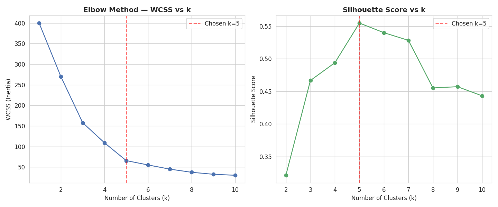
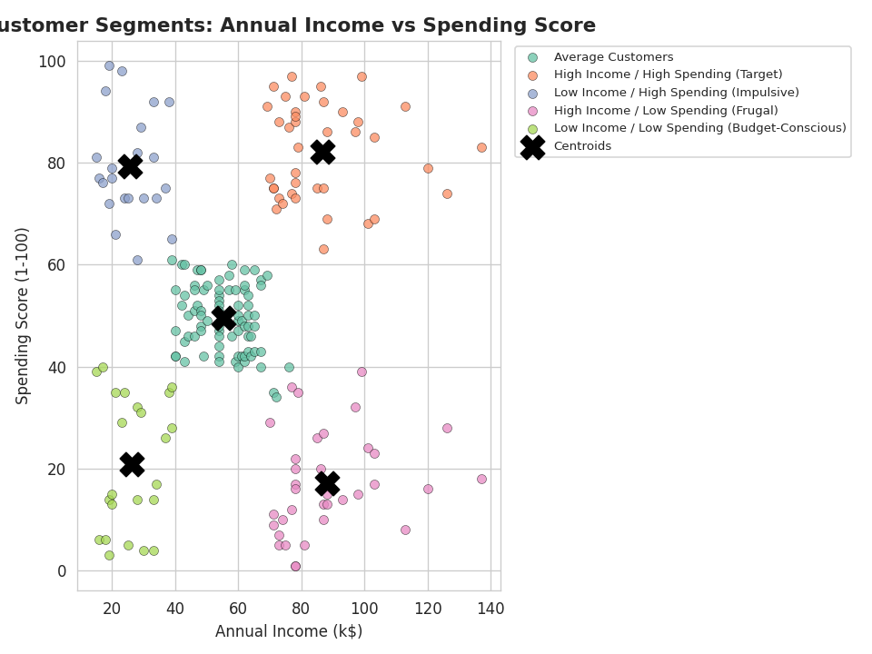
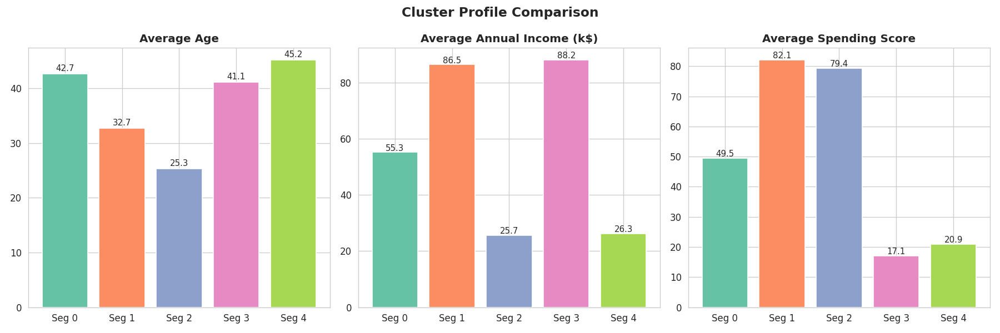
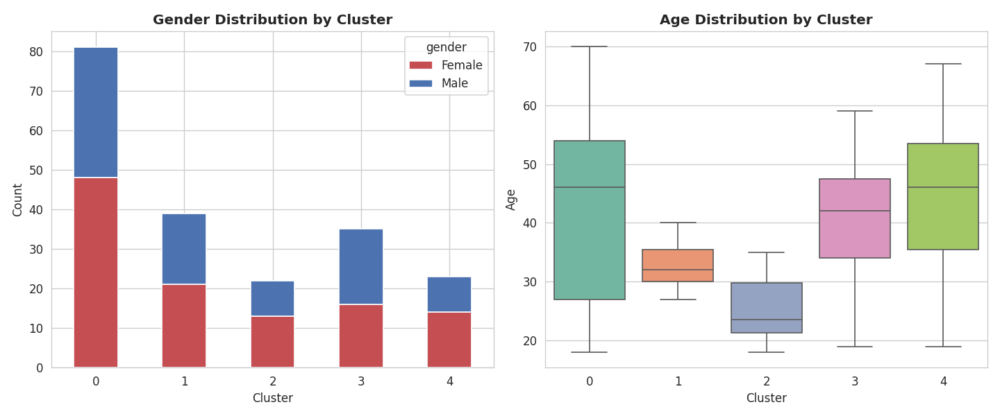

# Task 6: Customer Segmentation — Mall Customer Dataset

**Synent Technologies — Data Science Internship Program**
**Author:** Akshitha K

---

## 1. Project Overview
This project segments mall customers into distinct, business-meaningful
groups using **K-Means clustering**, based on their annual income and
spending behavior. Rather than stopping at the clustering output, each
segment is profiled and translated into an actionable customer persona —
the kind of insight a marketing or business team could act on directly.

## 2. Problem Statement
Treating all customers as a single undifferentiated group wastes marketing
spend and misses opportunities. The goal of this task is to group
customers based on behavior (not just demographics) so that distinct,
targetable segments emerge — and to identify which segment represents the
greatest untapped business opportunity.

## 3. Objective
- Preprocess and explore the Mall Customer dataset
- Apply K-Means clustering to segment customers by income and spending
  behavior
- Statistically determine the optimal number of clusters (elbow method +
  silhouette score), not guess it
- Profile each segment and derive unique, actionable business insights

## 4. Dataset
- **Name:** Mall Customer Segmentation Dataset
- **Source:** Kaggle — https://www.kaggle.com/datasets/vjchoudhary7/customer-segmentation-tutorial-in-python
- **Rows:** 200 | **Columns:** 5
- **Columns:** `CustomerID`, `Gender`, `Age`, `Annual Income (k$)`,
  `Spending Score (1-100)`
- **Missing values:** 0
- **Duplicate rows:** 0
- **Gender split:** 112 Female (56%), 88 Male (44%)
- **Age range:** 18–70 (mean 38.85)
- **Annual income range:** $15k–$137k (mean $60.56k)
- **Spending score range:** 1–99 (mean 50.2)

This is the exact, unmodified dataset as uploaded — no synthetic or
invented values were used anywhere in this project.

## 5. Tools & Technologies
- Python 3
- pandas, numpy — data handling
- scikit-learn — `StandardScaler`, `KMeans`, `silhouette_score`
- matplotlib, seaborn — visualization

## 6. Methodology / Approach

### 6.1 Data Preprocessing
- Verified the dataset is already clean (0 nulls, 0 duplicates).
- Renamed columns to clean snake_case (`annual_income_k`,
  `spending_score`, etc.) for consistency.

### 6.2 Exploratory Data Analysis
- Reviewed summary statistics and distributions of age, income, and
  spending score.
- Found that income is right-skewed (most customers earn $40–80k) while
  spending score is fairly evenly spread 1–99 — indicating income alone
  does not predict spending behavior, which is exactly why clustering on
  both dimensions together is useful.

### 6.3 Feature Selection & Scaling
- Clustered on **annual income** and **spending score** — the two
  variables that most directly describe purchasing behavior.
- Standardized both features with `StandardScaler` before clustering,
  since K-Means is distance-based and sensitive to feature scale.

### 6.4 Determining Optimal k
- Tested k = 1–10 using the **elbow method** (WCSS/inertia) and
  **silhouette score**.
- Both methods independently agreed: **k = 5** is optimal — WCSS drops
  sharply up to k=5 then flattens, and silhouette score peaks at k=5
  (**0.555**), the highest of any value tested.

### 6.5 Final Clustering
- Fit a final `KMeans(n_clusters=5, random_state=42)` model.
- Mapped each numeric cluster to a descriptive, business-relevant segment
  name based on its income/spending profile.

## 7. Visualizations

### Elbow Method & Silhouette Score


Shows WCSS and silhouette score across k=1–10, both pointing to k=5 as
optimal.

### Customer Segments (Income vs Spending Score)


The five segments plotted by income and spending score, with centroids
marked. The clusters are visually well-separated, consistent with the
0.555 silhouette score.

### Cluster Profile Comparison


Average age, income, and spending score compared across all five
segments.

### Gender & Age Distribution by Cluster


Shows that gender is evenly distributed across all segments, while age
varies meaningfully — younger customers dominate the "impulsive" segment.

## 8. Key Insights

| Segment | Size | Avg Age | Avg Income | Avg Spending | Profile |
|---|---|---|---|---|---|
| Average Customers | 81 (40.5%) | 42.7 | $55.3k | 49.5 | Broad, mid-range general audience |
| **High Income / High Spending (Target)** | 39 (19.5%) | 32.7 | $86.5k | 82.1 | Most valuable — prioritize for loyalty/premium offers |
| Low Income / High Spending (Impulsive) | 22 (11%) | 25.3 | $25.7k | 79.4 | Youngest segment; trend-driven spending |
| **High Income / Low Spending (Frugal)** | 35 (17.5%) | 41.1 | $88.2k | 17.1 | **Biggest untapped opportunity** — can afford to spend more |
| Low Income / Low Spending (Budget-Conscious) | 23 (11.5%) | 45.2 | $26.3k | 20.9 | Price-sensitive; best served by discounts |

- **The "High Income / Low Spending" segment is the standout finding**:
  these 35 customers earn nearly as much as the top "Target" segment
  ($88.2k vs $86.5k) but spend dramatically less (17.1 vs 82.1 spending
  score). They clearly have the means to spend more — this is the clearest
  revenue opportunity in the dataset.
- **Gender does not differentiate segments** — every cluster has a roughly
  even gender split, meaning gender is not a useful targeting variable
  here.
- **Age differentiates behavior more than income does** — the "Impulsive"
  segment (avg. age 25.3) spends heavily despite low income, while the two
  oldest segments (avg. age 41–45) are the most conservative spenders
  regardless of income level.
- **k=5 was statistically validated**, not an arbitrary choice — both the
  elbow curve and silhouette score independently converged on the same
  answer.

## 9. Results
- Final model: **K-Means, k=5, silhouette score = 0.555**
- 5 clearly separated, interpretable customer segments produced
- Segmented dataset exported to `mall_customers_segmented.csv`
  (original data + `cluster` and `segment` columns)
- Cluster-level summary exported to `cluster_profile_summary.csv`

## 10. Conclusion
K-Means clustering on income and spending score uncovered five
statistically distinct, business-meaningful customer segments rather than
one undifferentiated group. The standout, non-obvious finding is the
"High Income / Low Spending" segment — a group with strong purchasing
power that is currently underspending relative to its means, representing
the clearest actionable growth opportunity. This demonstrates the full
unsupervised-learning workflow: feature selection, scaling, statistically
validated model selection, and — most importantly — turning cluster
output into a concrete business recommendation.

## 11. Repository Structure
```
synent-task6-customersegmentation-Akshitha/
├── README.md
├── requirements.txt
├── Mall_Customers.csv              # original raw dataset
├── mall_customers_segmented.csv    # output: original data + cluster labels
├── cluster_profile_summary.csv     # per-segment summary statistics
├── customer_segmentation.ipynb     # full notebook with code and analysis
└── visualizations/
    ├── chart1_elbow_silhouette.png
    ├── chart2_cluster_scatter.png
    ├── chart3_cluster_profile.png
    └── chart4_gender_age_by_cluster.png
```

## 12. How to Run the Project
1. Clone or download this repository.
2. Install dependencies: `pip install -r requirements.txt`
3. Open `customer_segmentation.ipynb` in Jupyter Notebook, JupyterLab, VS
   Code, or Google Colab.
4. Run all cells in order — the notebook loads `Mall_Customers.csv` from
   the same folder and regenerates all charts and output CSVs.

---

## Submission Checklist
- [x] Genuine, uploaded Mall Customer dataset used — no synthetic data
- [x] Preprocessing, EDA, clustering, and profiling all completed
- [x] Optimal k statistically validated (elbow method + silhouette score)
- [x] 4 professional, labeled visualizations
- [x] Unique insight beyond basic clustering (High Income/Low Spending
      opportunity segment)
- [x] Notebook runs end-to-end without errors
- [x] README matches actual dataset and notebook results
- [ ] GitHub repository (public) — named
      `synent-task6-customersegmentation-Akshitha`
- [ ] Demonstration video link (1–3 minutes)
- [ ] Project shared on LinkedIn
